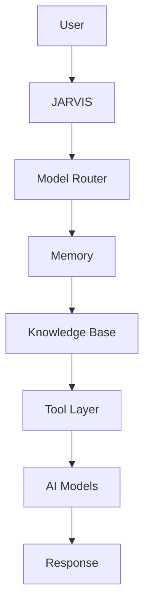

# JARVIS Architecture

## High-Level Flow

## Component Roles

### User
The person interacting with the system. The user submits tasks, asks questions, and reviews outputs.

### JARVIS
The orchestration layer for personal workflows. JARVIS should stay separate from Odysseus framework code and own the user-facing organization for prompts, knowledge, and automation.

### Model Router
Chooses which model or provider should handle the request. This is where routing rules, fallback logic, and provider preferences belong.

### Memory
Stores short-term and long-term context. Memory should keep recent task state, durable preferences, and reusable facts separate from raw conversation history.

### Knowledge Base
Holds curated material such as reference notes, project docs, personal knowledge, and research artifacts. This is not the same thing as memory; it is deliberate source material.

### Tool Layer
Wraps approved actions such as search, file operations, diagnostics, and workflow helpers. Tool access should be explicit, logged, and constrained.

### AI Models
The underlying model providers that generate or transform content. JARVIS should be able to swap providers without changing the workspace structure.

### Response
The final output returned to the user. Responses should be concise, actionable, and traceable to the relevant memory or knowledge sources when applicable.

## Suggested JARVIS Layout
- `JARVIS/Docs/` - operational notes and planning docs.
- `JARVIS/Knowledge/` - curated knowledge collections.
- `JARVIS/Prompts/` - reusable prompt templates.
- `JARVIS/Config/` - JARVIS-only configuration.
- `JARVIS/Backups/` - exported copies and snapshots.
- `JARVIS/Assets/` - local assets and media.
- `JARVIS/Scripts/` - helper scripts and automation.

## Odysseus Boundary
Odysseus should remain the platform. JARVIS should integrate through documented seams rather than editing framework-owned code unless a framework change is explicitly intended.

## Design Principles
- Keep the workspace modular.
- Separate personal intelligence from application internals.
- Prefer documentation first, then automation.
- Make every new capability observable and reversible.